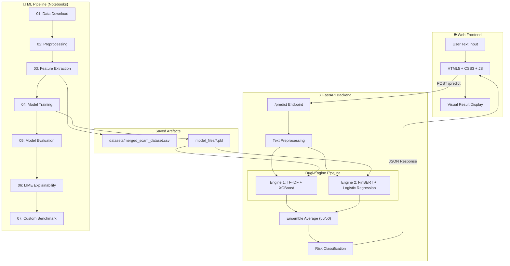
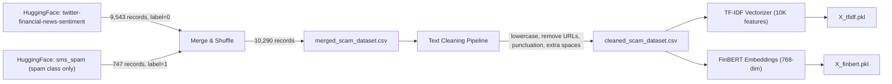
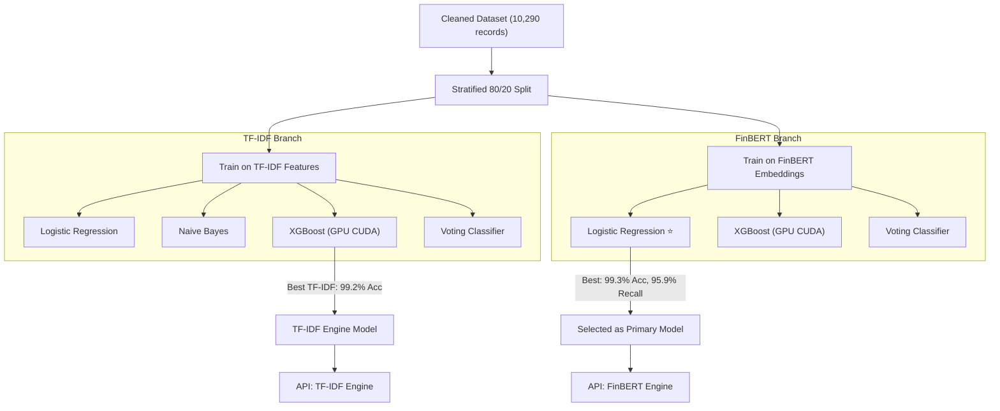
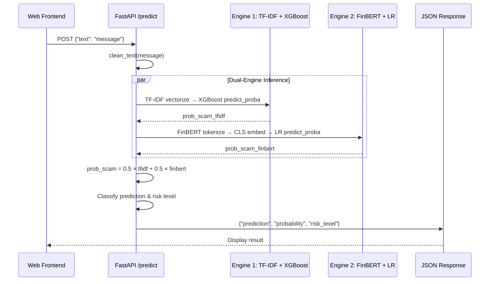
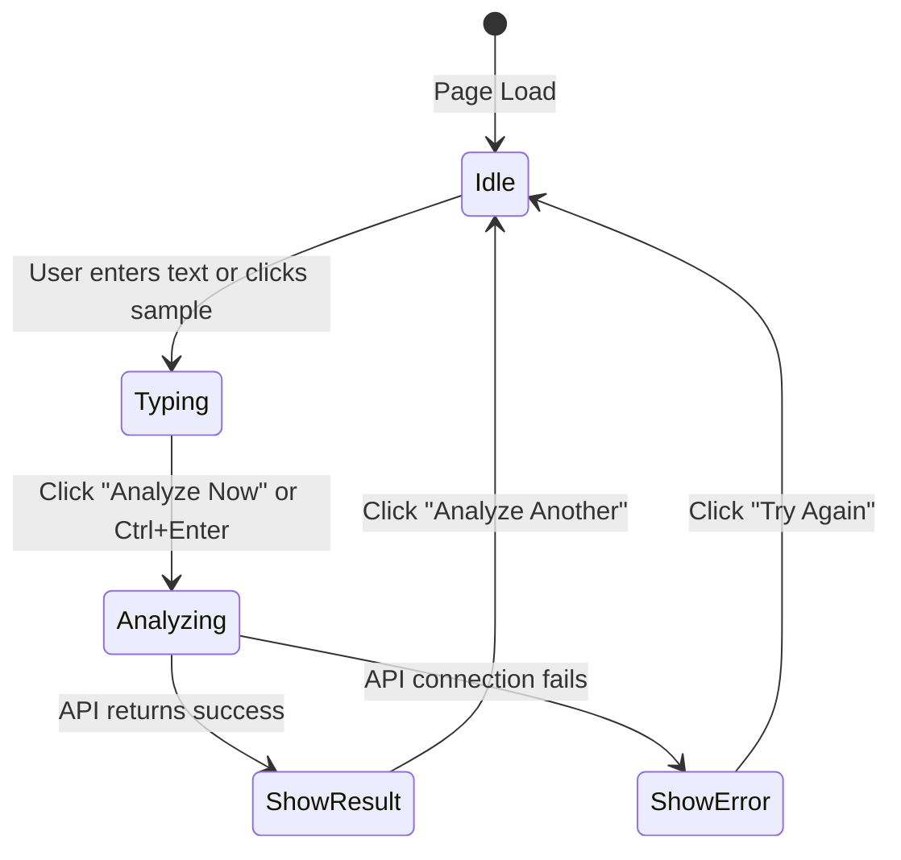

# 🏗️ System Architecture — ScamGuard AI

> Comprehensive architecture documentation for the AI-Based Fake Investment Scam & Ponzi Scheme Detection System.

---

## 1. System Overview

ScamGuard AI is a full-stack AI system that detects financial scams and Ponzi scheme promotions in social media text. The architecture follows a layered design:

| Layer | Technology | Purpose |
|-------|-----------|---------|
| **Data Layer** | HuggingFace Datasets, Pandas | Dataset acquisition, merging, cleaning |
| **Feature Layer** | TF-IDF (Scikit-learn), FinBERT (HuggingFace Transformers) | Dual feature extraction |
| **Model Layer** | Logistic Regression, Naive Bayes, XGBoost, Voting Classifier | Multi-model training & comparison |
| **Explainability** | LIME | Word-level scam indicators |
| **Backend API** | FastAPI, Uvicorn, Pydantic | REST prediction endpoint |
| **Frontend** | HTML5, CSS3, Vanilla JavaScript | User-facing web interface |

---

## 2. System Architecture Diagram



---

## 3. Data Pipeline Architecture

### Data Flow



### Text Cleaning Steps (Applied in `02_data_preprocessing.py` and `main.py`)

1. **Lowercase conversion** — normalize case
2. **URL removal** — strip `http://`, `https://`, `www.` links
3. **Punctuation removal** — keep only word characters and whitespace
4. **Whitespace normalization** — collapse multiple spaces, strip edges

---

## 4. Machine Learning Pipeline

### Training Flow



### Model Comparison

| Model | Features | Accuracy | Scam Recall | Notes |
|-------|----------|----------|-------------|-------|
| Naive Bayes | TF-IDF | 98.6% | 81.8% | Cannot handle negative FinBERT values |
| XGBoost (GPU) | TF-IDF | 99.2% | 89.9% | Used as TF-IDF engine in API |
| Voting Classifier | TF-IDF | 98.1% | 75.1% | Ensemble of LR + NB + XGBoost |
| XGBoost (GPU) | FinBERT | 99.1% | 90.6% | Strong but lower recall than LR |
| **Logistic Regression** ⭐ | **FinBERT** | **99.3%** | **95.9%** | **Primary model — highest recall** |

### Why Logistic Regression on FinBERT?

- **Recall is the key metric** — a missed scam (false negative) can lead to real financial loss.
- LR on FinBERT achieves **95.9% scam recall** vs. XGBoost's 90.6% on the same features.
- FinBERT captures **semantic meaning** of financial text, not just keyword matches.

---

## 5. Backend API Architecture

### Technology Stack
- **Framework:** FastAPI with Uvicorn ASGI server
- **Validation:** Pydantic models for request/response schemas
- **Serialization:** Joblib for loading `.pkl` model files
- **CORS:** Enabled for all origins (development mode)

### Dual-Engine Prediction Flow



### Risk Level Classification

| Probability | Risk Level |
|-------------|------------|
| > 0.70 | 🔴 High |
| 0.40 – 0.70 | 🟡 Medium |
| < 0.40 | 🟢 Low |

### API Endpoints

| Method | Path | Description |
|--------|------|-------------|
| `GET` | `/` | Welcome message |
| `POST` | `/predict` | Scam detection prediction |
| `GET` | `/docs` | Swagger UI (auto-generated) |

---

## 6. Frontend Interaction Flow



### Frontend Features
- **Premium dark-mode** UI with glassmorphism and animated background orbs
- **Sample messages** for quick testing (2 scam, 2 legitimate)
- **Character counter** on textarea input
- **Loading spinner** during API call
- **Animated probability bar** with color-coded risk levels
- **AI Confidence & Risk indicator cards**
- **Responsive design** for mobile (≤600px breakpoint)
- **Keyboard shortcut** — Ctrl+Enter to submit

---

## 7. Directory Architecture

```
scam-detection-project/
├── datasets/                     ← Data layer
│   ├── merged_scam_dataset.csv   ← 10,290 raw records
│   ├── cleaned_scam_dataset.csv  ← Preprocessed text
│   ├── X_tfidf.pkl               ← TF-IDF sparse matrix
│   ├── X_finbert.pkl             ← FinBERT 768-dim embeddings
│   ├── y_labels.pkl              ← Binary labels
│   └── README.md                 ← Dataset documentation
├── model_files/                  ← Serialized models
│   ├── tfidf_vectorizer.pkl      ← Fitted TF-IDF vectorizer
│   ├── scam_model.pkl            ← XGBoost (TF-IDF engine)
│   ├── primary_scam_model_lr_finbert.pkl ← LR (FinBERT engine)
│   ├── scam_model_tfidf.pkl      ← TF-IDF model backup
│   └── scam_model_finbert.pkl    ← FinBERT model backup
├── notebooks/                    ← ML pipeline scripts
│   ├── 01_data_download.py       ← HuggingFace data acquisition
│   ├── 02_data_preprocessing.py  ← Text cleaning
│   ├── 03_feature_extraction.py  ← TF-IDF + FinBERT extraction
│   ├── 04_model_training.py      ← Multi-model training
│   ├── 05_model_evaluation.py    ← Confusion matrix & LR selection
│   ├── 06_real_life_test.py      ← LIME explainability demo
│   ├── 07_custom_evaluation.py   ← 20-example custom benchmark
│   └── output.txt                ← Pipeline output logs
├── backend/
│   ├── main.py                   ← FastAPI dual-engine server
│   └── test_api.py               ← API integration tests
├── frontend/
│   ├── index.html                ← Web interface
│   ├── style.css                 ← Dark-mode premium styling
│   └── app.js                    ← Frontend logic & API calls
└── README.md                     ← Project documentation
```
